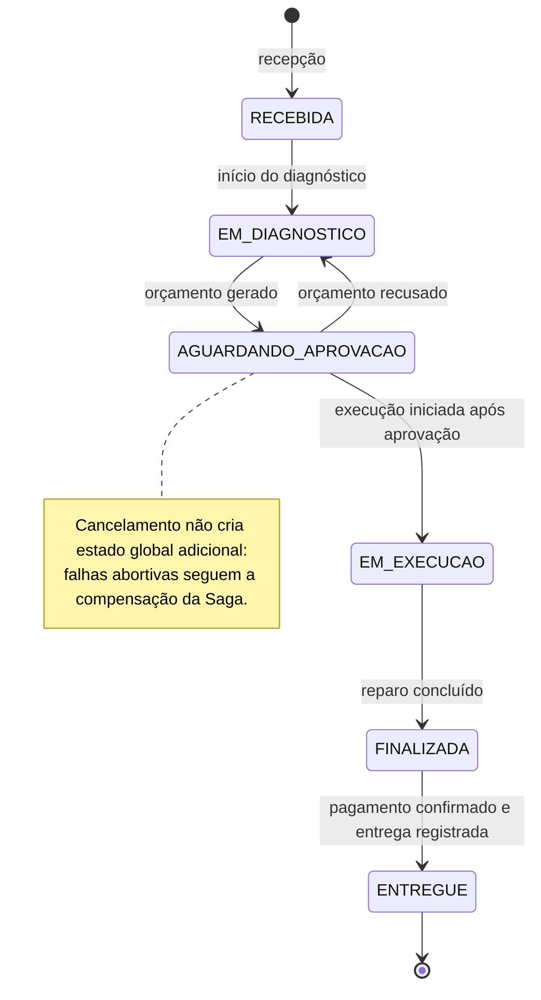
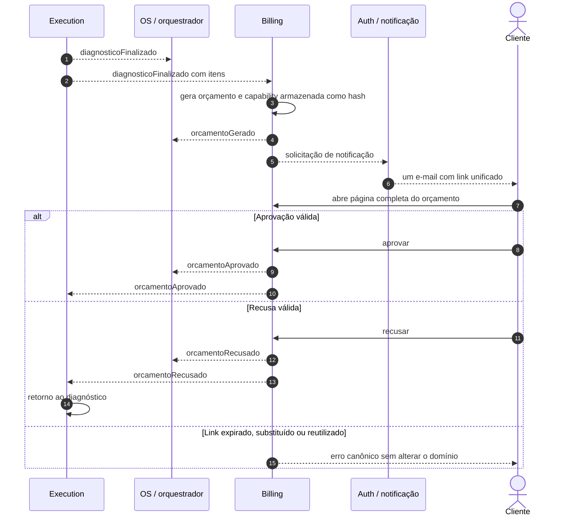
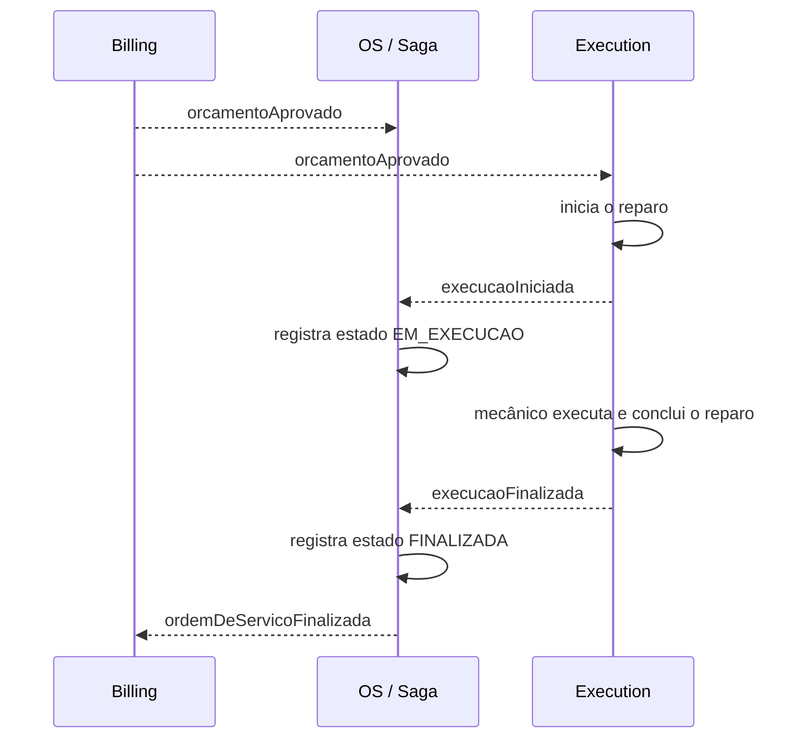
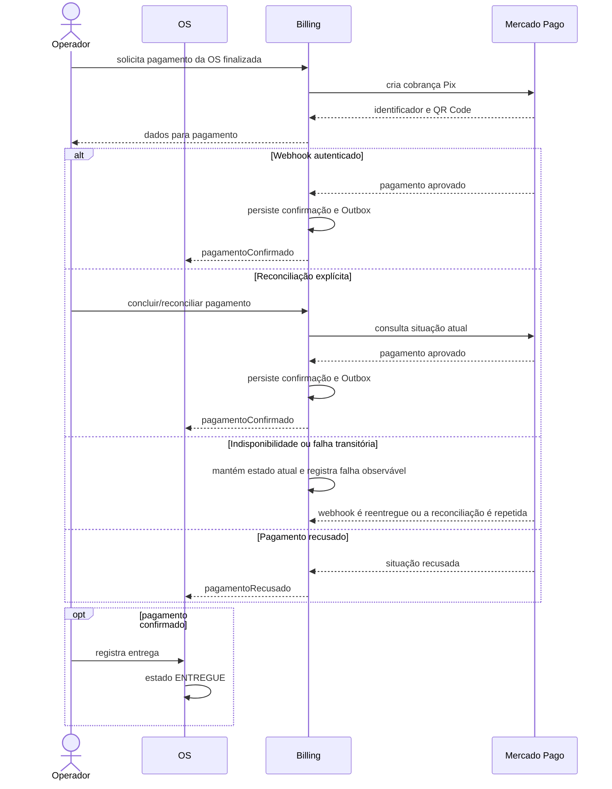
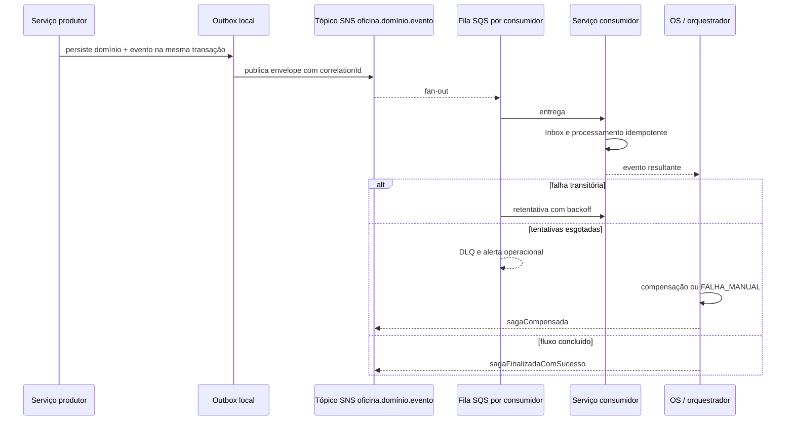
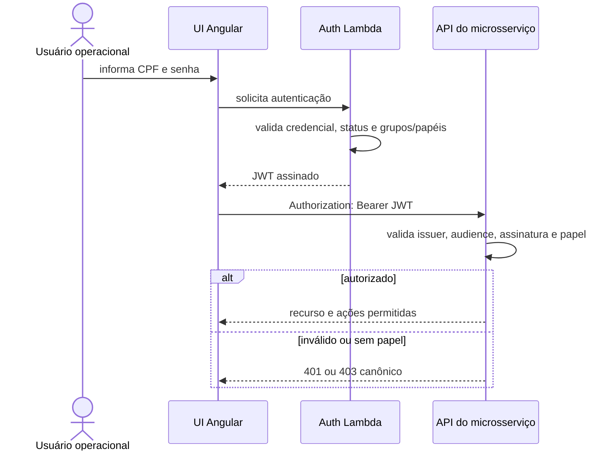
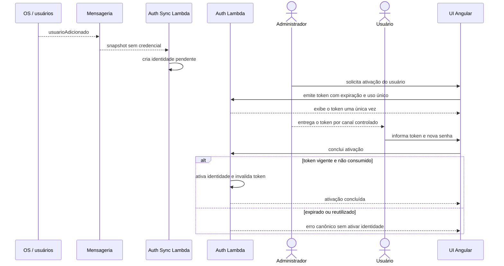

# oficina-platform
Seu objetivo é centralizar a governança da plataforma, fornecendo uma visão unificada da arquitetura e servindo como fonte oficial para contratos, padrões e decisões compartilhadas.

## Repositórios da plataforma

Os microsserviços canônicos da plataforma possuem repositórios independentes na mesma suíte:

| Repositório | Responsabilidade |
| --- | --- |
| `../oficina-os-service` | Gestão da Ordem de Serviço, cadastros principais e orquestração da Saga. |
| `../oficina-billing-service` | Cobrança, pagamentos e integrações financeiras. |
| `../oficina-execution-service` | Catálogo técnico de peças e serviços, diagnóstico, execução, estoque operacional e finalização do serviço. |
| `../oficina-ui` | Interface operacional Angular, sem regras de negócio, para recepção, administração e mecânicos. |

Os repositórios remotos verificados seguem a organização `oficina-soat` no GitHub:

- `git@github.com:oficina-soat/oficina-os-service.git`
- `git@github.com:oficina-soat/oficina-billing-service.git`
- `git@github.com:oficina-soat/oficina-execution-service.git`

Este repositório continua sendo a fonte normativa para ADRs, contratos, OpenAPI, eventos, padrões e artefatos compartilhados. Código de aplicação, pipelines específicos e manifestos próprios permanecem nos repositórios dos microsserviços.

## Padrões Reutilizáveis

- [Template de regras para monolito modular](templates/monolito-modular/README.md): referência canônica copiada do `oficina-app` para orientar `AGENTS.md` e testes estruturais de arquitetura nos microsserviços.

## Roadmap

O planejamento incremental da plataforma, incluindo lacunas restantes e backlog orientado a agentes, está documentado em [ROADMAP.md](ROADMAP.md).

O planejamento do frontend Angular está separado no [Roadmap do frontend operacional](docs/frontend/roadmap.md) e é executado quando o usuário direcionar o trabalho ao `oficina-ui`.

## Fluxos operacionais

Os diagramas abaixo são a visão transversal canônica. As regras detalhadas permanecem no [fluxo da Saga](docs/architecture/saga-flows.md), no [contrato da Saga](contracts/saga/oficina-os-saga-v1.md), no [contrato REST](contracts/Contrato%20de%20APIs%20REST.md) e no [contrato de tópicos](contracts/Contrato%20de%20T%C3%B3picos%20de%20Mensageria.md).

### Ciclo de vida da Ordem de Serviço



### Orçamento e decisão do cliente



### Aprovação, reparo e conclusão técnica



### Pagamento e entrega



### Saga assíncrona e confiabilidade



Cada evento usa o produtor, tópico e consumidores definidos na [tabela canônica de roteamento](contracts/Contrato%20de%20T%C3%B3picos%20de%20Mensageria.md#tabela-can%C3%B4nica-de-roteamento).

### Autenticação e autorização



### Ativação de usuário



## Documentação

A documentação normativa está organizada por tema em [docs/](docs/README.md):

- [Arquitetura](docs/README.md#arquitetura)
- [Infraestrutura](docs/README.md#infraestrutura)
- [Observabilidade](docs/README.md#observabilidade)
- [Entrega e Validação](docs/README.md#entrega-e-validação)

## Scripts manuais

- [generate-bearer-token.sh](scripts/manual/generate-bearer-token.sh): gera um header `Authorization: Bearer ...` chamando `POST /auth/token` da `auth-lambda` do ambiente `lab`. Por padrão usa o usuário administrativo seedado, com papéis `administrativo`, `mecanico` e `recepcionista`.

Uso padrão:

```bash
scripts/manual/generate-bearer-token.sh
```

Para obter apenas o token, use:

```bash
scripts/manual/generate-bearer-token.sh --raw
```

Se a senha administrativa do ambiente mudar, use `AUTH_PASSWORD`, `AUTH_PASSWORD_FILE` ou `--password-file` para sobrescrever o valor seedado:

```bash
AUTH_PASSWORD_FILE=/tmp/oficina-auth-password \
  scripts/manual/generate-bearer-token.sh
```
