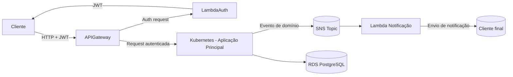

## Status

Aprovado

---
## Contexto

A aplicação evoluiu para uma arquitetura distribuída composta por:
- API Gateway como ponto de entrada
- Function serverless para autenticação
- Aplicação principal executando em Kubernetes
- Banco de dados gerenciado
- Componentes de observabilidade
- Mecanismo de notificações via Lambda

O cenário exige:
- comunicação segura e padronizada
- desacoplamento entre componentes
- suporte a escalabilidade
- rastreabilidade ponta a ponta
- integração com serviços serverless

Além disso, o enunciado exige uso de API Gateway, autenticação com JWT, serverless para autenticação e notificações, além de observabilidade distribuída

---
## Decisão
Será adotado um **modelo híbrido de comunicação**, composto por comunicação síncrona e assíncrona, com padronização clara por tipo de interação.

---
## 1. Comunicação síncrona (HTTP/REST)
Utilizada para:
- entrada de requisições externas
- autenticação
- operações de negócio

### Padrão
- protocolo: HTTPS
- formato: JSON
- autenticação: JWT
- entrada via API Gateway
- versionamento via URL

### Fluxo
- Cliente → API Gateway → Lambda (auth) ou Aplicação principal

---
## 2. Comunicação assíncrona (eventos)
### Decisão principal
Será adotado **Amazon SNS como mecanismo padrão de publicação de eventos para notificações**.

---
### 2.1 SNS + Lambda (padrão único)
Utilizado para:
- notificações imediatas
- eventos de domínio (ex: OS finalizada)
- integração desacoplada

### Justificativa
- baixo custo operacional
- integração direta com Lambda
- simplicidade de implementação
- suporte a múltiplos consumidores (fan-out)
- desacoplamento entre produtor e consumidor

### Características
- modelo publish/subscribe
- eventos imutáveis
- comunicação assíncrona
- múltiplos consumidores possíveis

---
## 3. Segurança
- todas as comunicações via HTTPS
- autenticação via JWT
- validação no API Gateway e na aplicação
- uso de claims para autorização

---
## 4. Observabilidade
Todas as interações devem propagar:
- `trace_id`
- `correlation_id`

Logs:

- formato JSON
- rastreáveis entre serviços

---
## 5. Padronização de eventos
Eventos devem:
- ser imutáveis
- conter identificadores de rastreio
- seguir nomenclatura de domínio

Exemplo:
{  
  "event_type": "OrdemDeServicoFinalizada",  
  "timestamp": "...",  
  "ordem_id": "...",  
  "cliente_id": "...",  
  "trace_id": "..."  
}

---
## 6. Responsabilidades
- **API Gateway**
    - autenticação inicial
    - roteamento
- **Lambda (auth)**
    - geração de JWT
- **Aplicação principal**
    - regras de negócio
    - publicação de eventos no SNS
- **SNS**
    - distribuição de eventos
- **Lambda (notificações)**
    - envio de notificações

---
## Diagrama de Comunicação

---
## Consequências
### Benefícios
- baixo custo com SNS como padrão
- desacoplamento entre aplicação e notificações
- simplicidade arquitetural
- suporte a múltiplos consumidores
- escalabilidade nativa
- aderência direta ao enunciado

---
### Trade-offs
- menor controle de retry comparado a filas
- necessidade de padronização rigorosa de eventos
- dependência de entrega assíncrona

---
### Riscos
- uso inadequado de eventos pode gerar inconsistência
- ausência de correlação pode prejudicar rastreabilidade
- crescimento desorganizado de tópicos SNS

---
## Diretrizes futuras
- adotar outbox pattern para garantir consistência na publicação de eventos
- versionar eventos de domínio
- manter governança sobre tópicos e contratos
- avaliar uso de filas caso surjam necessidades de maior resiliência