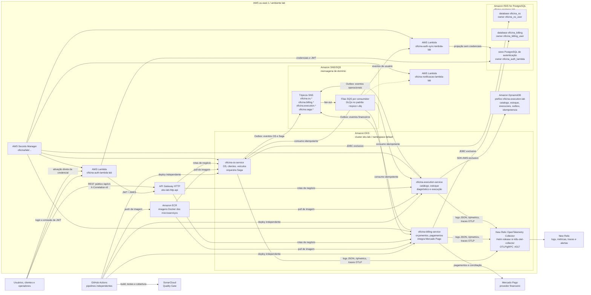

# Diagrama Geral da Arquitetura Final

## Objetivo

Representar a arquitetura final da Fase 4 com os três microsserviços, persistência independente, mensageria assíncrona, deploy em Kubernetes, observabilidade distribuída e integração financeira externa.

Este documento complementa o [Checklist Final de Entrega da Fase 4](../delivery/phase-4-delivery-checklist.md), a [Matriz de Ownership por Microsserviço](service-ownership.md), as [Rotas públicas do API Gateway](../infrastructure/api-gateway-public-routes.md), o [Escopo do Repositório Unificado de Infraestrutura](../infrastructure/infrastructure-repository-scope.md), o [Padrão de Observabilidade Distribuída](../observability/observability.md), o [Contrato de Tópicos de Mensageria](../../contracts/Contrato%20de%20Tópicos%20de%20Mensageria.md) e a [ADR-012 - Estratégia de CI/CD e Deploy Independente](../../adr/ADR-012%20-%20Estratégia%20de%20CI%20CD%20e%20Deploy%20Independente.md).

## Diagrama

## Leitura do Diagrama

| Bloco | Decisão canônica |
|---|---|
| Entrada pública | O API Gateway HTTP `eks-lab-http-api` expõe somente as rotas REST de negócio definidas em [Rotas públicas do API Gateway](../infrastructure/api-gateway-public-routes.md). Endpoints `/q/health`, `/q/metrics`, `/q/openapi` e Swagger UI não são rotas públicas permanentes de negócio. |
| Autenticação e notificações | `oficina-auth-lambda-lab`, `oficina-auth-sync-lambda-lab` e `oficina-notificacao-lambda-lab` permanecem como componentes serverless separados dos três microsserviços, conforme a [ADR-003 - Serverless para Autenticação e Notificações](../../adr/ADR-003%20-%20Serverless%20para%20Autenticação%20e%20Notificações.md). O consumidor de sincronização recebe somente dados operacionais e compartilha o store da autenticação, nunca o database do OS. |
| Kubernetes | Os workloads de negócio rodam no cluster `eks-lab`. Os manifests executáveis pertencem ao `oficina-infra`, enquanto este repositório mantém os templates e decisões conforme a [Estratégia de entrega dos manifestos Kubernetes](../infrastructure/kubernetes-manifest-strategy.md). |
| Persistência relacional | `oficina-os-service` usa somente o database `oficina_os`; `oficina-billing-service` usa somente `oficina_billing`; ambos ficam na instância RDS `oficina-postgres-lab`, conforme o [Padrão de isolamento PostgreSQL no RDS compartilhado](../infrastructure/rds-postgresql-isolation.md). As Lambdas de autenticação e sincronização compartilham um terceiro store PostgreSQL próprio, sem acesso aos databases dos microsserviços. |
| Persistência NoSQL | `oficina-execution-service` usa exclusivamente as tabelas DynamoDB com prefixo `oficina-execution-lab`, conforme o [Padrão DynamoDB do oficina-execution-service](../infrastructure/dynamodb-execution-service.md). |
| Mensageria | Eventos são publicados via Outbox em tópicos SNS canônicos e consumidos por filas SQS por consumidor, com DLQs no padrão do [Contrato de Tópicos de Mensageria](../../contracts/Contrato%20de%20Tópicos%20de%20Mensageria.md). |
| Saga | A Saga da Ordem de Serviço é orquestrada pelo `oficina-os-service`, com participantes financeiros e operacionais nos outros serviços, conforme [Fluxos da Saga da Ordem de Serviço](saga-flows.md) e o [Contrato de Saga do oficina-os-service](../../contracts/saga/oficina-os-saga-v1.md). |
| Observabilidade | Os três microsserviços propagam `correlationId`, emitem logs JSON, expõem `/q/metrics` e enviam traces OTLP/gRPC para o New Relic OpenTelemetry Collector `nr-k8s-otel-collector-gateway.newrelic.svc.cluster.local:4317`, conforme o [Padrão de Observabilidade Distribuída](../observability/observability.md). |
| Deploy independente | Cada microsserviço possui pipeline independente, publica imagem no Amazon ECR e pode acionar deploy Kubernetes quando as condições do [Checklist de Deploy Independente](../delivery/independent-deploy-checklist.md) estiverem atendidas. |
| Integração externa | A integração com Mercado Pago pertence ao `oficina-billing-service`; os demais serviços não chamam diretamente o provedor financeiro. |

## Limites Arquiteturais

- Nenhum microsserviço acessa diretamente o banco de outro microsserviço.
- Comunicação entre microsserviços ocorre por REST ou eventos de domínio.
- Eventos devem ser publicados somente após persistência local, usando Outbox.
- `oficina-platform` não contém código runtime dos microsserviços nem infraestrutura executável.
- `oficina-infra` é o destino canônico para Terraform, Kubernetes, API Gateway, RDS, DynamoDB, SNS/SQS, ECR, New Relic OpenTelemetry Collector e scripts operacionais.
- `oficina-app`, `oficina-infra-db` e `oficina-infra-k8s` não aparecem como runtime final da Fase 4; quando consultados, servem apenas como fonte histórica ou origem de cópia controlada.

## Referências

- [ADR-008 - Estratégia de Comunicação entre Microsserviços](../../adr/ADR-008%20-%20Estratégia%20de%20Comunicação%20entre%20Microsserviços.md)
- [ADR-009 - Estratégia de Saga Pattern](../../adr/ADR-009%20-%20Estratégia%20de%20Saga%20Pattern.md)
- [ADR-010 - Estratégia de Divisão dos Microsserviços](../../adr/ADR-010%20-%20Estratégia%20de%20Divisão%20dos%20Microsserviços.md)
- [ADR-011 - Estratégia de Persistência Poliglota por Microsserviço](../../adr/ADR-011%20-%20Estratégia%20de%20Persistência%20Poliglota%20por%20Microsserviço.md)
- [ADR-012 - Estratégia de CI/CD e Deploy Independente](../../adr/ADR-012%20-%20Estratégia%20de%20CI%20CD%20e%20Deploy%20Independente.md)
- [Contrato de APIs REST](../../contracts/Contrato%20de%20APIs%20REST.md)
- [Contrato de Eventos de Domínio](../../contracts/Contrato%20de%20Eventos%20de%20Domínio.md)
- [Contrato de Tópicos de Mensageria](../../contracts/Contrato%20de%20Tópicos%20de%20Mensageria.md)
- [Contrato de Idempotência](../../contracts/idempotency.md)
- [Contrato de Erros REST](../../contracts/error-model.md)
- [Runbooks Operacionais Mínimos](../observability/operational-runbooks.md)
