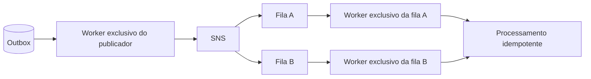

# Plano de redução da defasagem da jornada operacional

## Objetivo

Planejar a correção da defasagem entre um comando aceito por um microsserviço e a convergência do estado canônico da jornada no `oficina-os-service`. O plano parte da [medição de atualização da jornada](journey-freshness-measurement.md), detalha o trabalho de mensageria que deve constar no [roadmap](../../ROADMAP.md) e preserva a necessidade de formalizar a decisão na ADR prevista antes da implementação.

Este plano ataca primeiro a causa medida. Polling, SSE ou WebSocket tratam apenas o trecho posterior à convergência e devem ser reavaliados depois da correção e da nova medição.

## Linha de base

Em 18/07/2026, no `lab`, os comandos de diagnóstico responderam em 182–195 ms, mas o estado global convergiu somente após 57,192–70,450 s.

| Trecho | Resultado observado | Participação no atraso |
|---|---:|---:|
| Resposta HTTP → publicação da Outbox | 43,365–58,178 s | 76%–83% |
| Publicação → consumo e persistência no OS | 12,272–13,826 s | 17%–24% |
| Resposta HTTP → convergência no OS | 57,192–70,450 s | 100% |

A [medição do dashboard](../frontend/realtime-update-measurement.md) encontrou outro custo: leituras entre aproximadamente 0,5 s na mediana e 3–4 s na cauda. Esse tempo deve continuar sendo observado, mas não explica o minuto de divergência após os comandos.

## Causa técnica confirmada

O desenho implantado acopla trabalho com características incompatíveis:

1. o publicador consulta e publica registros pendentes da Outbox;
2. o consumidor percorre uma lista de filas SQS;
3. cada fila vazia pode manter uma chamada em long polling;
4. o próximo trabalho só começa depois que o ciclo anterior termina;
5. o atraso cresce com a posição da fila e com a quantidade de filas sem mensagem.

O intervalo configurado do scheduler é, portanto, apenas o atraso entre ciclos. Ele não limita a duração de um ciclo nem a idade máxima de um evento pendente.

Na revisão do código local realizada em 18/07/2026:

- `oficina-execution-service` ainda usa uma única thread para publicar a Outbox e depois consumir todas as filas;
- `oficina-os-service` já possui executores distintos para publicação e consumo, mas o consumidor ainda percorre as filas sequencialmente;
- `oficina-billing-service` ainda usa uma única thread para publicação e consumo sequencial.

O Execution e o OS constituem o caminho mínimo do caso medido. O Billing também precisa adotar o mesmo padrão para que orçamento, aprovação, pagamento e compensações não mantenham ou reintroduzam a mesma classe de atraso na jornada completa.

## Arquitetura de execução proposta

Cada pod deve possuir unidades de execução independentes, com ciclo de vida e falhas isolados:

O publicador não pode aguardar leitura SQS. Cada fila deve ter seu próprio loop de long polling, ou uma abstração equivalente que garanta concorrência limitada e isolamento por fila. Uma fila vazia, lenta ou com mensagem inválida não pode bloquear as demais.

A paralelização é entre filas. Dentro de cada fila, o processamento deve continuar compatível com as garantias do [Contrato de Tópicos de Mensageria](../../contracts/Contrato%20de%20Tópicos%20de%20Mensageria.md) e do [Contrato de Idempotência](../../contracts/idempotency.md). Não se deve assumir ordenação global; quando a transição exigir progressão por OS, o consumidor deve validar `aggregateId`, estado atual e evento já processado antes de persistir efeitos.

## Planejamento incremental

### 1. Formalizar decisão e meta

- registrar na ADR o desacoplamento do publicador e o isolamento de consumidor por fila como primeira correção;
- decidir limites de concorrência, encerramento gracioso, comportamento com múltiplas réplicas e preservação de idempotência, retries e DLQ;
- definir a meta de comando até convergência e o tamanho mínimo da amostra de homologação;
- adiar a escolha de SSE/WebSocket até existir a medição posterior à correção da mensageria.

Meta recomendada para avaliação na ADR: `p95` de resposta HTTP até convergência no OS menor ou igual a 10 s e nenhuma amostra acima de 20 s, em uma janela sem backlog prévio. Esses valores são proposta, não contrato vigente.

### 2. Preparar observabilidade comparável

- preservar `eventId`, `correlationId`, `aggregateId` e timestamps entre comando, Outbox, publicação e consumo;
- medir separadamente idade até publicação, duração da publicação, espera até recebimento SQS e duração do processamento;
- expor backlog e idade do item mais antigo por Outbox e fila;
- identificar o worker ou fila nos logs, sem registrar JWT, token público ou dado pessoal;
- criar alertas para idade acima da meta, crescimento contínuo e worker encerrado ou sem progresso.

Essa etapa deve anteceder o rollout para evitar uma comparação baseada apenas em percepção visual.

### 3. Separar o publicador da Outbox

- criar worker exclusivo do publicador no Execution e no Billing;
- confirmar no OS que o desacoplamento local está coberto por testes e presente no artefato implantado;
- garantir que falha ou long polling de consumidor não altere a frequência do publicador;
- manter consulta de pendentes por índice, batch limitado, backoff, estados `PENDING`, `PUBLISHED` e `FAILED` e o mesmo `eventId` nas retentativas;
- implementar encerramento gracioso sem abandonar publicação já iniciada;
- evitar publicação concorrente indevida entre réplicas mediante atualização condicional, claim ou mecanismo equivalente aprovado na ADR.

### 4. Isolar e paralelizar os consumidores

- criar um loop independente por fila consumida em Execution, OS e Billing;
- limitar explicitamente threads, conexões e mensagens em voo para não transformar paralelismo em pressão ilimitada sobre banco e AWS;
- manter long polling por fila, sem varredura sequencial de tópicos;
- isolar falhas: exceção em uma fila não encerra nem atrasa os outros consumidores;
- preservar confirmação somente após persistência idempotente e manter mensagens falhas disponíveis para retry e DLQ;
- garantir encerramento gracioso e recriação controlada de workers que terminem inesperadamente.

### 5. Cobrir comportamento e resiliência

- testar que uma fila vazia em long polling não atrasa o publicador nem outra fila com mensagem;
- testar concorrência entre filas e processamento seguro de eventos da mesma OS;
- testar duplicidade, evento fora de ordem, backlog, consumidor lento, falha de SNS/SQS, restart de pod e múltiplas réplicas;
- comprovar retry e DLQ sem perda nem efeito de negócio duplicado;
- executar testes de integração com LocalStack/DynamoDB Local ou PostgreSQL conforme o serviço;
- executar `clean verify` com JaCoCo e a validação SonarCloud aplicável em cada microsserviço.

### 6. Implantar de forma controlada

- publicar novas versões dos três microsserviços e configurações de infraestrutura necessárias;
- implantar primeiro no `lab`, confirmando threads, conexões, consumo de CPU, pool de banco e chamadas SQS;
- observar backlog, idade da Outbox, erros, DLQ e reinícios antes de executar a jornada;
- manter rollback por versão e por configuração do worker;
- não habilitar polling, SSE ou WebSocket no frontend durante esta rodada, para isolar o efeito da correção.

### 7. Repetir a medição e comparar

- repetir no `lab` os mesmos marcos da linha de base: término HTTP, `PENDING`, `PUBLISHED`, consumo e persistência no OS;
- usar, no mínimo, 30 amostras por transição para início e conclusão de diagnóstico, sem backlog prévio, registrando média, p50, p95 e máximo;
- incluir retomada após recusa, início/fim de reparo, pagamento e entrega para verificar Execution, OS e Billing;
- comparar cada trecho e a latência total com os valores de 18/07/2026;
- registrar versão dos serviços, configuração de polling, quantidade de réplicas, região e condições de backlog;
- considerar a correção aprovada somente se atingir a meta definida na ADR sem perda, duplicação de efeitos, crescimento de DLQ ou saturação relevante;
- caso a meta não seja atingida, identificar o novo trecho dominante antes de propor alteração no frontend;
- somente depois dessa comparação reavaliar atualização manual, polling limitado, SSE e WebSocket para o intervalo entre convergência e navegador.

## Critérios de pronto do épico

- publicadores não compartilham loop nem executor com consumidores;
- uma fila possui unidade de consumo independente e não bloqueia outra fila;
- idempotência, retries, DLQ e validação de progressão da Saga permanecem cobertos;
- métricas permitem decompor comando → publicação → consumo → convergência;
- jornada completa é homologada no `lab` sem regressão funcional;
- nova evidência apresenta comparação direta com 57,192–70,450 s e conclusão objetiva sobre a meta;
- qualquer decisão posterior de atualização automática do frontend usa a nova linha de base.

## Fora do escopo desta correção

- implementar regra de negócio ou inferir capabilities no frontend;
- substituir o snapshot persistido do OS como fonte da verdade;
- adotar SSE, WebSocket ou coordenação síncrona antes da ADR e da remedição;
- alterar nomes de eventos, tópicos, produtores, consumidores ou estados da OS;
- aumentar paralelismo sem limite ou sem observar a capacidade de banco, SQS e pods.
