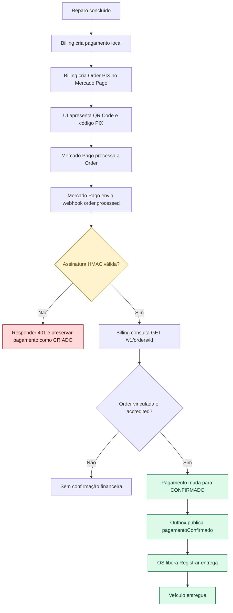
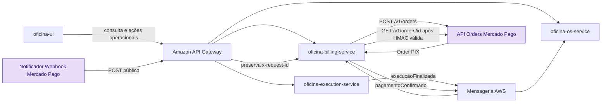
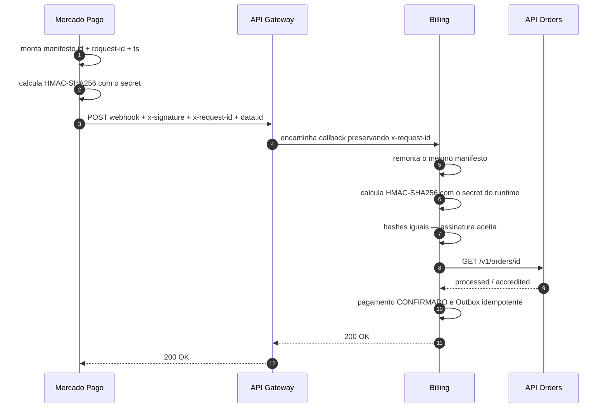
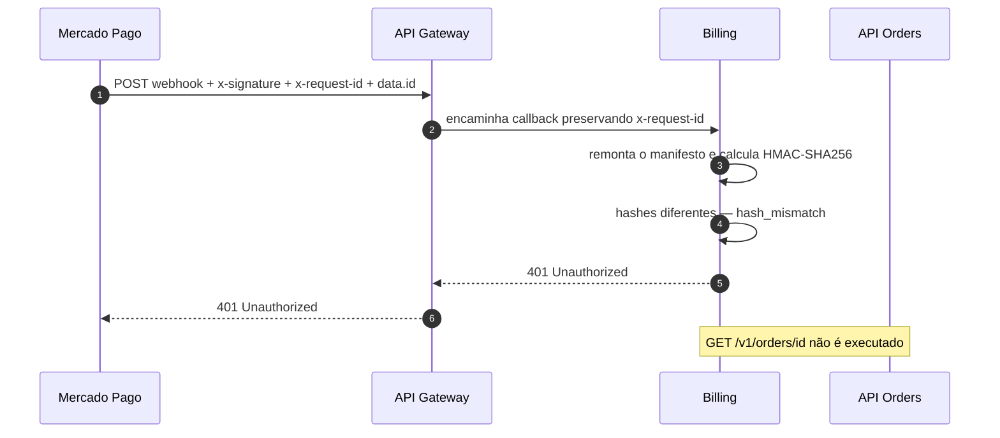
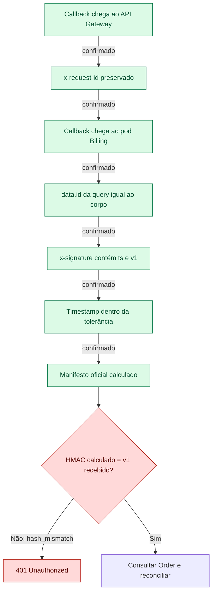
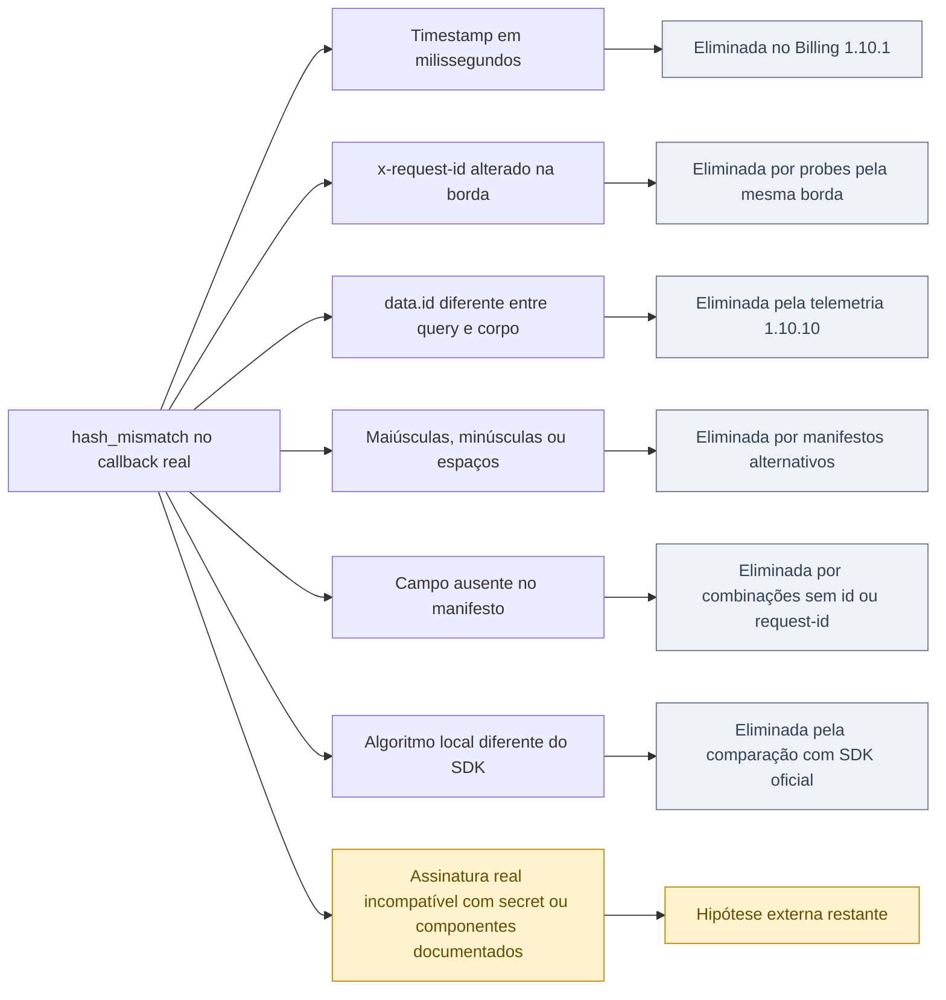

# Fluxo e diagnóstico do webhook de Orders do Mercado Pago

Este documento explica visualmente a jornada completa de pagamento PIX que está sendo homologada, o caminho percorrido pelo callback do Mercado Pago e o ponto exato em que a confirmação automática está sendo interrompida.

O diagnóstico detalhado e as execuções remotas estão na [evidência de continuidade do pagamento no lab](../delivery/payment-checkout-continuity-lab-evidence.md). As tarefas ainda abertas estão no [roadmap da plataforma](../../ROADMAP.md#continuidade-do-pagamento-e-entrega-pela-ui).

## Objetivo da jornada

O fluxo esperado começa após o reparo da Ordem de Serviço e termina na entrega do veículo. O Mercado Pago é a fonte de verdade da situação financeira; o Billing só pode confirmar o pagamento depois de validar a origem da notificação e consultar a Order no provedor.



Atualmente, o fluxo segue o ramo vermelho: a Order é criada e processada pelo Mercado Pago, mas o Billing rejeita o callback antes de consultar a Order.

## Componentes envolvidos



Somente a rota `POST /api/v1/integracoes/mercado-pago/webhooks` é pública. A consulta da Order acontece do Billing para o Mercado Pago e não depende do conteúdo financeiro recebido no corpo do webhook.

## Como a assinatura deveria ser validada

Para cada notificação, o Mercado Pago envia três componentes usados na validação:

- `data.id`, recebido na query string;
- `x-request-id`, recebido como header HTTP;
- `ts`, extraído do header `x-signature`.

O manifesto documentado é construído nesta ordem. Na [instrução manual de validação do Mercado Pago](https://www.mercadopago.com.br/developers/pt/docs/split-payments/additional-content/your-integrations/notifications/webhooks), um `data.id` alfanumérico deve ser convertido para minúsculas somente para esse cálculo:

```text
id:<data.id normalizado>;request-id:<x-request-id>;ts:<ts>;
```

O Mercado Pago calcula um HMAC-SHA256 desse manifesto usando o secret do webhook. O Billing repete o cálculo com o secret projetado no pod e compara os dois hashes em tempo constante. Como o SDK Java oficial atual descreve o `data.id` literal, o Billing `1.10.11` aceita a forma normalizada e a forma literal quando qualquer uma delas produz uma assinatura válida com o mesmo secret. Essa compatibilidade não altera o identificador original usado em `GET /v1/orders/{id}`.

Existem dois resultados mutuamente exclusivos para uma chamada de webhook. Se o hash for válido, o Billing consulta a API Orders, recebe `processed/accredited`, confirma o pagamento e responde `200` ao callback. Se o hash for inválido, o Billing responde `401` imediatamente e não consulta a API Orders. Uma mesma chamada nunca percorre os dois fluxos.

### Fluxo esperado quando o hash é válido



Nesse fluxo, o `processed/accredited` é a resposta da consulta autenticada do Billing à API Orders. O `200 OK` é a resposta do Billing à chamada de webhook que iniciou o processamento.

### Fluxo atual quando o hash é inválido



## Ponto exato da falha atual

A falha acontece exclusivamente na comparação HMAC, depois que os campos obrigatórios foram recebidos e o timestamp passou pela validação temporal, mas antes de qualquer consulta financeira ao provedor.



O erro não ocorre na criação da Order, no processamento do PIX, na rota pública, no parse do corpo, na tolerância do timestamp ou na consulta da Order. A consulta nem chega a ser executada nessa tentativa porque uma notificação não autenticada não pode produzir confirmação financeira.

## O que os testes já comprovaram

| Verificação | Resultado | Interpretação |
|---|---|---|
| Criação de Order PIX | Funciona | O access token de teste é aceito pela API Orders. |
| Processamento da Order | `processed/accredited` | O Mercado Pago processa o cenário de teste. |
| Entrega do callback real | Funciona | URL, evento Orders e conectividade pública estão corretos. |
| Simulação de produção no painel | `200` | O endpoint e o secret do runtime validam a assinatura simulada. |
| Simulação de teste no painel | `200` | O mesmo ocorre no modo de teste do simulador. |
| Probe assinado com o secret do runtime | Assinatura aceita | O cálculo HMAC do Billing funciona com `ts` de 10 e 13 dígitos. |
| Callback real de Orders | `401 hash_mismatch` | O hash real não corresponde ao cálculo local. |
| Query `data.id` versus corpo | Iguais | Não há troca de identificador entre a borda e o pod. |
| Componentes da assinatura | `ts,v1` | Os componentes obrigatórios reconhecidos estão presentes. |
| Formato de `data.id` | 32 caracteres alfanuméricos em maiúsculas | O formato esperado de uma Order foi preservado. |
| Manifestos alternativos seguros | Nenhuma correspondência | Minúsculas, espaços e omissões documentadas não explicam o hash. |
| Algoritmo do SDK oficial | Equivalente | O Billing usa os mesmos pares e a mesma ordem do validador oficial. |

## Hipóteses eliminadas e hipótese restante



Essa conclusão não permite afirmar sem evidência qual valor o Mercado Pago utilizou para assinar o callback real. Ela comprova apenas que o resultado recebido não é compatível com o secret configurado e os componentes documentados que chegam ao Billing. Por isso, a próxima ação é o escalonamento ao suporte do Mercado Pago, e não a flexibilização da segurança.

## Sobre os dois números de aplicação

Durante a investigação, a interface do Mercado Pago apresentou `554294311968810` na tela de credenciais de teste e `8556144455468533` em **Dados da integração** e nas simulações de webhook. Essa diferença foi registrada, mas não demonstra sozinha a causa do `hash_mismatch`: criação da Order, simulações e callbacks podem expor identificadores de contextos distintos da mesma integração.

O chamado ao Mercado Pago deve pedir que o provedor confirme explicitamente:

1. qual aplicação e configuração de webhook assinam callbacks reais das Orders criadas com o access token de teste;
2. qual secret de webhook está associado a esse assinador;
3. se callbacks reais de Orders usam algum componente de manifesto diferente do SDK e da documentação;
4. por que simulações da aplicação `8556144455468533` validam, mas notificações reais das Orders não.

Não devem ser anexados ao chamado o secret, o access token, o valor de `x-signature`, dados PIX ou payloads contendo dados pessoais. Horários, códigos HTTP, versões do Billing e classificações sanitizadas são suficientes para correlação inicial.

## Estado seguro enquanto o problema permanece

O sistema falha de forma segura:

- o Billing responde `401` quando não consegue autenticar a notificação;
- o pagamento local permanece `CRIADO` e não é confirmado por confiança no corpo do webhook;
- nenhuma Outbox `pagamentoConfirmado` é publicada;
- a capability **Registrar entrega** não é liberada indevidamente;
- a reconciliação autenticada **Atualizar situação** continua disponível como procedimento operacional, consultando diretamente a Order no Mercado Pago.

Após a correção externa, a jornada deve ser repetida até comprovar webhook real `200` → pagamento `CONFIRMADO` → Outbox única → capability **Registrar entrega** → Ordem de Serviço `ENTREGUE`. Só então a instrumentação temporária poderá ser removida ou reduzida a métricas operacionais de baixa cardinalidade.

## Exceção temporária para captura bruta no `lab`

Como as comparações sanitizadas não identificaram a origem do `hash_mismatch`, foi autorizada uma captura pontual da requisição completa no ambiente de testes. O Billing `1.10.12` adiciona a variável `OFICINA_MERCADO_PAGO_WEBHOOK_RAW_CAPTURE_ENABLED`, desabilitada por padrão e recusada no startup fora de `lab` ou `test`. Quando habilitada, a primeira chamada ao webhook é gravada em `${user.dir}/.oficina-diagnostics/mercado-pago-webhook-request.json` — `/work/.oficina-diagnostics/mercado-pago-webhook-request.json` na imagem atual — com URI e query string, todos os headers e corpo brutos. A evidência não é enviada a logs, traces, métricas ou armazenamento persistente; o arquivo tem limite de 1 MiB, fica em diretório privado com modo `0700`, recebe modo `0600` e não é sobrescrito por chamadas posteriores.

Essa exceção não altera a validação da assinatura nem a resposta funcional do webhook. Sua sequência operacional obrigatória é:

1. implantar o Billing `1.10.12` com a captura ainda desabilitada;
2. habilitar a variável somente no deployment de `lab` e aguardar o rollout;
3. produzir uma única Order de teste e aguardar o callback real;
4. ler o arquivo uma única vez para a análise autorizada;
5. apagar `/work/.oficina-diagnostics/mercado-pago-webhook-request.json`, remover a variável do deployment e confirmar o rollout;
6. registrar apenas conclusões sanitizadas na evidência permanente;
7. remover a classe de captura, a propriedade e estas instruções em uma versão subsequente do Billing.

A tarefa `[D-PAYMENT-CONTINUITY-WEBHOOK-DIAG-001]` do [roadmap](../../ROADMAP.md) permanece aberta até a limpeza do mecanismo temporário e a comprovação do fluxo corrigido.
